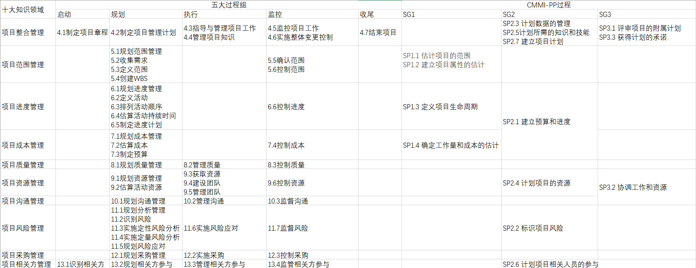

1、了解CMMI项目管理过程-项目计划（PP），使用知识域*过程矩阵对比项目规划过程组与CMMI-PP过程

联系：都覆盖多个知识域，主要工作都是制定项目计划（包括进度成本风险等等）

区别：项目规划过程组划分较细、CMMI-PP过程分三阶段进行

2、阅读JWD案例的前期准备任务，结合创新项目实践，构建软件项目创新竞赛项目准备过程（组），该过程（组）目标交付物为Business Case 

项目前期准备（商业论证）

 决定项目范围、时间、成本约束

 决定项目功能、目标用户

 开发项目业务场景

 开会讨论项目管理过程

 确定项目是否分为多个子项目

里程碑：**Business Case** 文档

