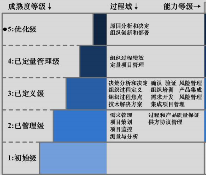

简单介绍CMMI

CMMI全称是Capability Maturity Model Integration，能力成熟度模型集成，CMMI可以看作是成功企业如何做好软件的一些习惯、做法、准则等的集合，是如何做好软件的最佳实践的集合，如果企业能按照CMMI的要求进行软件开发，那么会大大提高软件开发成功的可能性。

CMMI有两种表述方式：连续式与阶段式，两种方式只是从不同的角度来阐述CMMI，其实质上表达的内容是一致的，上图采用的是阶段式的表述方式：所有软件组织的软件能力成熟度划分为5个等级——第1到第5级。数字越大，成熟度越高，高成熟度等级代表比较强的综合软件能力，等级是层层递进的，也就是说要满足第三级必须先满足第二级，同理要满足第四级必须满足第三级和第二级。

CMMI二级，完成级。

第1级是不需要评估的，所有能完成软件开发的企业都能达到完成级。

CMMI二级，管理级。 
在管理级水平上，企业在项目实施上能够遵守既定的计划与流程，对整个流程有监测与控制，体现为**对项目的一系列的管理程序，排除了企业在一级时完成任务的随机性**。

CMMI三级，定义级。 
在定义级水平上，能够根据自身的特殊情况以及自己的标准流程，将这套管理体系与流程予以**制度化，科学的管理成为企业的一种文化**。

CMMI四级，量化管理级。 
在量化管理级水平上，企业的项目管理不仅形成了一种制度，而且要**实现数字化的管理，降低项目实施在质量上的波动**。

CMMI五级，优化级。 
在优化级水平上，企业能够充分利用信息资料，对企业在项目实施的过程中可能出现的次品予以预防,**主动地改善流程，运用新技术，实现流程的优化**。

CMMI提供了评价一个软件组织开发软件水平的科学模型，如果一家企业能达到某个级别，也就是说能按照某些经实践认证大概率可行的方法来开发软件，那么开发软件的成功率会大大提升，软件的质量也会提高。

在CMMI提出后，软件公司为了能得到更高的评级，将主动改进开发软件的方式、流程以及标准，无疑将提升整个软件行业的生产力。