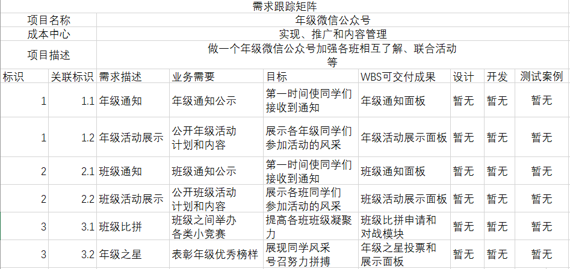
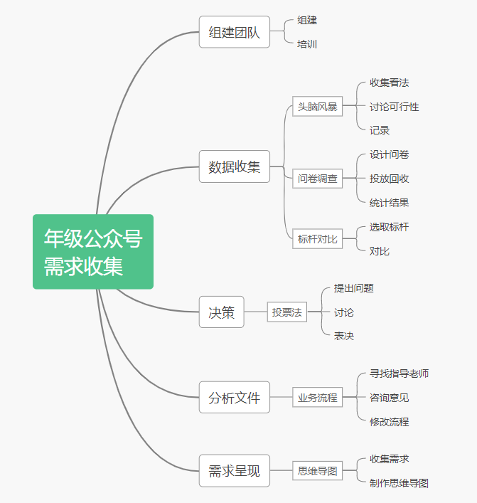

1. 你联合同学做一个年级微信公众号加强各班相互了解、联合活动等。请写一份两页的报告，描述收集需求的方法，并附上收集的需求跟踪矩阵（不少于五个需求）；

     收集需求的方法：

    - 数据收集：

    （1）头脑风暴：群体讨论，开放性的收集项目或产品需求

    召集参与该项目的所有同学，针对该年级公众号应当满足的需求发表自己的看法，讨论想法的可行性，有争议的点可以先保留等到后面再决定，减少分歧和耗时。

    （2）问卷调查：采用五点量表，或开放问题调查，成本中等

    为了完善需求可能需要采集一些数据，需要先开会设计调查问卷，然后投放到各个班级，还可以多打印几份给年级老师征求意见，为了得到较真实的数据可能需要剔除部分问卷的结果。

    （3）标杆对照 ：用计划的产品或过程对比类似已有的产品或过程

    参考已有的年级公众号的功能，结合用户对该功能的评价，比较实用或者比较新颖而广受好评的功能可以选择加入到需求中，同时也要考虑添加一些其他公众号没有的点，使得我们的年级公众号能在众多类似的公众号中脱颖而出。

    - 业务流程： 收集相关事情的已有处理流程

    由于缺乏相关经验，最好能找到一位指导老师，询问关于业务流程方面的问题

    - 决策：

    （4）投票法： 按多数人意愿决定项目范围或产品需求

    由于参与的都是同学，很难说谁的意见就足够权威，而且人数不多投票也不会耽误太多时间，所以在决策这一块采用投票法。

    - 需求呈现：

    （5）思维导图： 需求分级、分层

    最终决定的需求通过制作成思维导图的方式进行呈现，主要优点是制作便捷，有许多现成的思维导图制作工具。

    

    

    

    需求跟踪矩阵

    

2. 使用**思维导图**，为作业1或2构建WBS ，并使用项目管理工具制作WBS或根特图。并按要求检查工作包的可管理性，分解完整性。例如：检查测试、培训等；

WBS如下：

检查工作包的可管理性、分解完整性：

从上往下：每个工作包的时间成本以及人力资源安排都是可预估的，也覆盖了整个需求管理流程