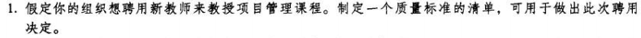
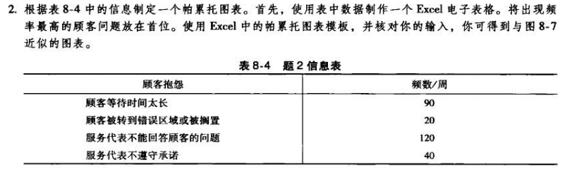
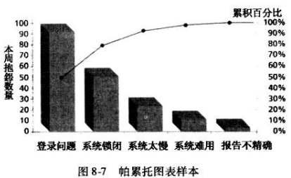
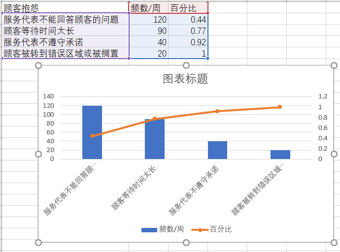
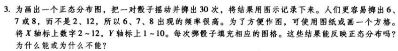
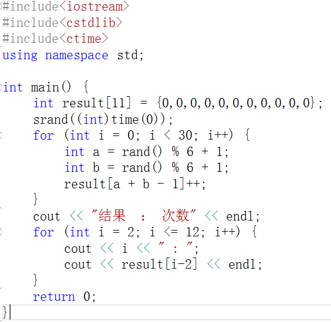
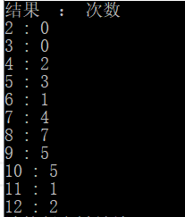
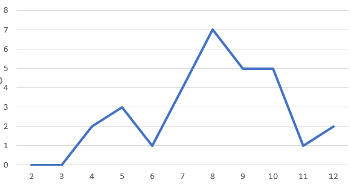

解答：

| 质量指标   | 度量               |
| ---------- | ------------------ |
| 学历       | 硕士以上，博士优先 |
| 专业       | 计算机师范         |
| 执教时长   | 2年以上            |
| 执教评价   | 无不良记录         |
| **加分项** |                    |
| 学术成果   | 发表的论文         |
| 教学成果   | 执教取得的成就     |

解答：如图

效果和图8.7类似

解答：

使用随机数模拟，代码以及结果如下

和正态分布有差距，原因应该是测试次数不够