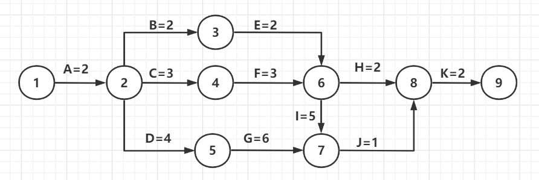
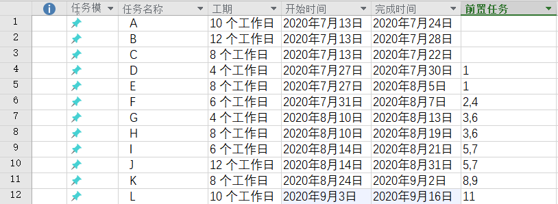
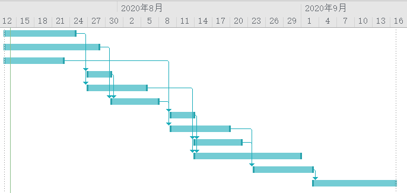
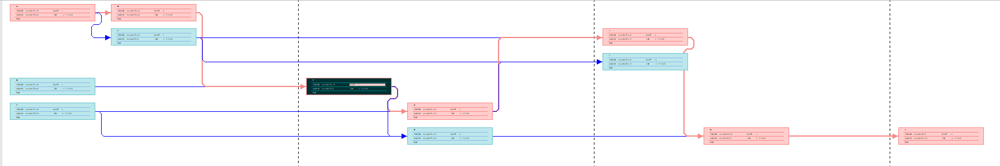
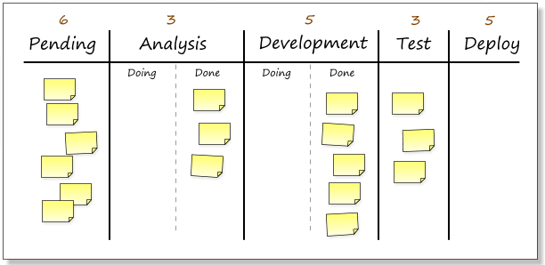
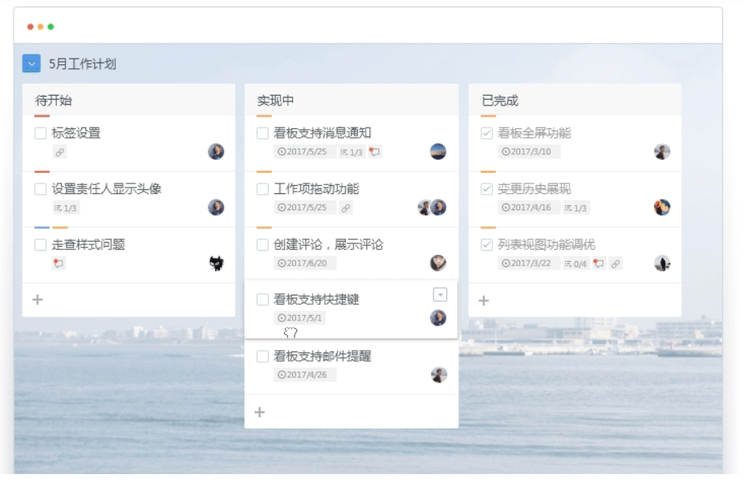

1、

a、如图

b、

路径1：ABEHK，长度：2+2+2+2+2=10

路径2：ABEIJK，长度：2+2+2+5+1+2=14

路径3：ACFHK，长度：2+3+3+2+2=12

路径4：ACFIJK，长度：2+3+3+5+1+2=16

路径5：ADGJK，长度：2+4+6+1+2=15

c、

路径4：ACFIJK，长度：2+3+3+5+1+2=16

d

最短时间为最长路径的长度16

2、

a

任务进度表

甘特图

网络图

**任务进度表**以列表的方式详细记载每个任务的工期、前置条件，只要确定了没有前置条件的任务（A，B，C）的开始时间（7/13），系统自动计算其他任务的开始和结束时间

**甘特图**的纵坐标表示时间，每个区间表示一个任务的执行过程，区间的坐标表示开始和结束时间，区间长度表示工期，区间的箭头表示任务的前置后置关系

**网络图**的每个节点表示一个任务，包含工期、开始时间和结束时间，节点的连线表示任务的前置后置关系，然后黑色节点表示当前日期应当执行的任务，红色节点表示关键路径

3、收集网上资料，总结看板在软件项目中的使用

**看板**是敏捷开发经常使用的进度管理工具，是一种基于**精益思**想的软件开发方法，精益指的是以最小资源投入创造更大价值

最简单的形式的看板系统包括了一个挂在墙上的大白板，上面有许多卡片或即时贴，以一定方式分组和排序（例如下图按开发阶段分组，按优先级排序）

看板的初始目的在于**可视化工作**，让每个人看到所有工作项的进展和相应的优先级，看板具有以下作用：

- 可视化工作流，每个人都能了解项目进展

- 任务排序，高优先级的任务率先完成，低优先级的任务也不会遗漏

- 工作可视化，各个成员可以看到自己完成的工作有多少，量化自己对项目的贡献

- 全体人员可见，是团队沟通的好工具

    

对于不同的项目根据特性可以采用不同的看板模式：
1.“特性看板”的长处在于向全团队提供项目的一个高度抽象的视角。可以搭配停车场图来显示出最高层次的状态。
2.“故事看板”处在中间层次，向团队提供每次迭代的最广泛周密的信息，搭配迭代的燃尽图会更有效。
3.“任务看板”的层次最低，它显示出每日变动的当前状态，搭配每日的燃尽图会更有帮助。
