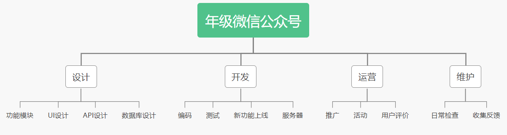
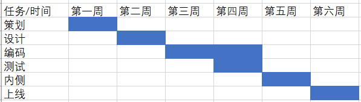
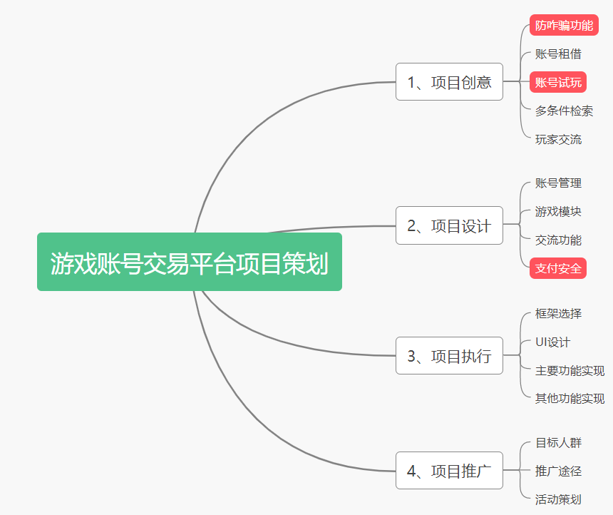

# 作业4

1、你联合同学做一个年级微信公众号加强各班相互了解、联合活动等。请编制项目章程和项目管理计划，指导该项目实施与运营。必须包含 WBS 和 甘特图；

（1）项目章程

> 项目名称：年级微信公众号
>
> 项目目的：运营年级微信公众号，号加强各班相互了解、联合活动等
>
> 项目起止时间：202X年X月~202X年X月
>
> 项目发起人：XXX
>
> 项目经理：XXX
>
> 项目目标：成功搭建年级微信公众号，得到大部分（2/3以上）同学的认可
>
> 高层级需求：更多功能加入，推广到多个年级
>
> 整体项目风险：
>
> - 预算不足
> - 不能有效推广
> - 完成得不够理想，得不到足够多认可
>
> 总体里程碑进度计划：
>
> 202X年X月：开会确定分工、资源分配以及进度安排
>
> 202X年X月：完成公众号的创建及相关服务的配置
>
> 202X年X月：进行内部测试，完善功能
>
> 202X年X月：正式上线，在年级进行推广，收集反馈评价
>
> 预先批准的财务资源：
>
> - 学校支持的经费：XXX
>
> - 拉取其他赞助：XXX
>
> 关键相关方名单：项目发起人、项目团队、其他赞助商

（2）项目管理计划

> 项目名称：年级微信公众号
>
> 项目目的：运营年级微信公众号，号加强各班相互了解、联合活动等
>
> 项目起止时间：202X年X月~202X年X月
>
> 人员分工：
>
> - 项目经理：XX
> - 前端：XX
> - 后端：XX
> - 运营：XX
>
> WBS：
>
> 
>
> 甘特图：
>
> 

3、召开一个项目策划研讨会，每个人用**思维导图**记录会议内容，该图必须满足“话题跟踪、热点标注、要点排序、问题汇总”四个基本要求。最后，给出这样会议记录的优点与缺点

优点：能有效记录会议重点，提高生产力

缺点：思维导图只能表达简单的分层结构，需要把部分精力用于记录

